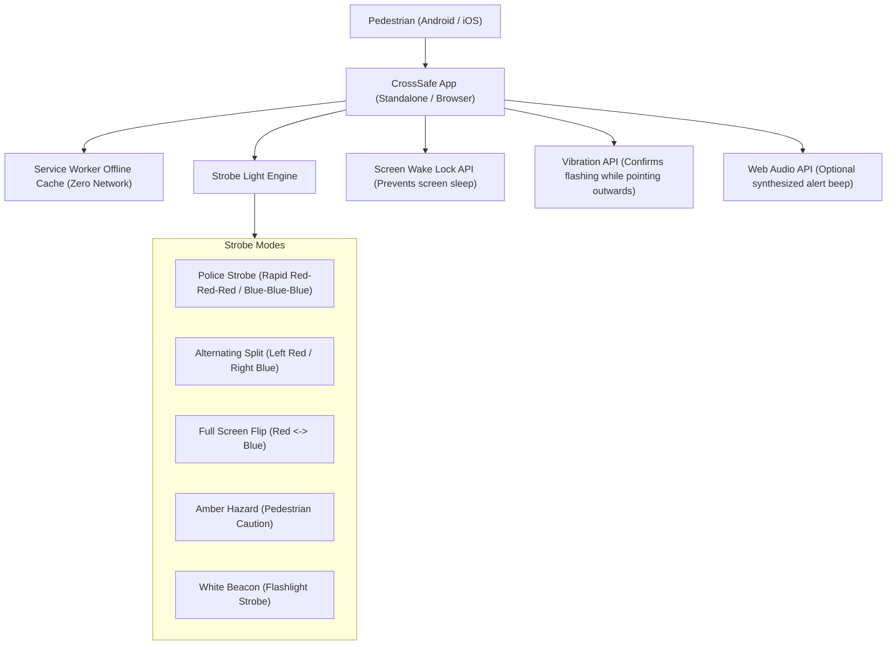

# Implementation Plan - CrossSafe: Offline Road Crossing Assist

Build an offline-first, zero-data **Progressive Web App (PWA)** that pedestrians can run on both Android and iPhone to safely cross roads at night or in low visibility. The app will feature high-conspicuity flashing warning lights (red and blue emergency strobe patterns, split strobe, and amber caution), Screen Wake Lock to prevent the display from sleeping, haptic vibration cues, and optional synthesized audio crossing beeps.

## Why a Progressive Web App (PWA)?

- **Works on both Android & iOS**: No App Store / Google Play account, no sideloading, and no platform locking required.
- **100% Offline Capability**: Once loaded once or saved to the home screen, the Service Worker caches all assets locally. It never touches mobile data or Wi-Fi again.
- **Saveable Locally**: Can also be used as a standalone single-file offline package or added to home screen as an app icon.
- **Hardware Access**: Modern mobile browsers support the **Screen Wake Lock API** (keeps screen bright and awake), **Vibration API** (confirms strobe is active while screen faces traffic), and **Web Audio API** (synthesizes audio alerts with zero asset downloads).

---

## User Review Required

> [!NOTE]
> **Legal Note on Red & Blue Lights**: In some jurisdictions, civilian display of flashing red and blue lights towards moving traffic can be restricted or confused with emergency vehicles. 
> To maximize safety and legal versatility, the app will default to **Emergency Red & Blue Strobe**, but will also include a quick-toggle for **Amber/Yellow Hazard Strobe** and **High-Lumen White Beacon** modes.

> [!IMPORTANT]
> **iOS Fullscreen & Wake Lock Behavior**: On iPhones, running the app via "Add to Home Screen" (standalone Web Clip) provides a full native-like fullscreen experience without browser URL bars. The app will include clear, 1-tap instructions for both iOS Safari and Android Chrome.

---

## Proposed Features & Architecture (Baseline)

### Key Components

1. **Light Engine & Visual Modes**:
   - **Police Emergency Strobe**: Quad-flash Red $\rightarrow$ quad-flash Blue (emulates emergency vehicle strobes, maximum human eye conspicuity).
   - **Alternating Split**: Left half red, right half blue, alternating at rapid or steady cadences.
   - **Full Alternating**: Full-screen solid red toggling to solid blue.
   - **Amber Hazard Warning**: Standard pedestrian / road work amber flashing.
   - **White Beacon**: High-lumen flashlight pulse.
   - **Text Overlay Toggle**: Optional large high-contrast "STOP" or "CROSSING" badge flashing alongside colors.

2. **Pedestrian Experience**:
   - **Giant "HOLD / TAP TO CROSS" Button**: Designed for immediate 1-handed activation.
   - **Screen Wake Lock API**: Automatically requests `screen` wake lock so the phone doesn't dim or turn off mid-crosswalk.
   - **Tactile Feedback**: Pulses the phone's vibrator periodically so the pedestrian knows the light is still flashing even while holding the screen faced toward oncoming traffic.
   - **Synthesized Audio Alert**: Optional audio chirp using Web Audio (no external mp3 files required).
   - **Flash Frequency Selector**: 5 adjustable speeds from Ultra Slow (~0.5 Hz) to Rapid Emergency (~8.0 Hz).

3. **Offline & Installation Infrastructure**:
   - `manifest.webmanifest`: App name, theme colors, icons, `display: standalone`.
   - `sw.js`: Service worker caching core assets permanently on install.
   - Completely vanilla (No external frameworks, zero network round-trips, under 100 KB total size).

---

## Baseline Proposed Changes

### Web Application Core

#### `index.html`
- Clean, dark-mode pedestrian dashboard.
- Fullscreen flash overlay container with GPU-accelerated CSS transitions.
- Quick-access controls (Mode selector, Speed toggle, Sound toggle, Haptics toggle).
- "How to save offline" guidance modal for both iPhone (Safari) and Android (Chrome).

#### `styles.css`
- High-visibility color definitions (`#FF0015` pure red, `#0051FF` police blue, `#FFB300` amber hazard).
- Hardware-accelerated CSS strobe animations and fullscreen overlay layouts.
- Touch-friendly, high-contrast UI designed for night-time use without blinding the user when configuring settings.

#### `app.js`
- Strobe timing loop (requestAnimationFrame / high-precision interval).
- Wake Lock API integration (`navigator.wakeLock`).
- Vibration API integration (`navigator.vibrate`).
- Web Audio synthesizer (custom oscillator chirps).
- Offline service worker registration and install prompt handler.

#### `sw.js`
- Service Worker caching all files (`index.html`, `styles.css`, `app.js`, `manifest.webmanifest`, icons).
- Cache-first offline execution.

#### `manifest.webmanifest` & App Icons
- PWA manifest and generated SVG/PNG icons for home screen installation.

#### `crosssafe.html`
- Standalone self-contained single-file edition for instant direct sharing (AirDrop / WhatsApp).

---

## Baseline Verification Plan

### Automated / Browser Verification
- Launch local HTTP server to verify PWA Service Worker registration, manifest validity, and offline cache readiness.
- Validate JavaScript syntax, audio oscillator generation, and strobe state transitions.
- Test offline mode by stopping the server or simulating offline network state in DevTools to ensure the app continues to function seamlessly without internet.

### Manual Verification
- Test full-screen strobe modes (Police rapid strobe, split, amber).
- Test Wake Lock activation and release.
- Test vibration haptic pulse triggering.
- Test responsive view on simulated mobile viewport (iPhone and Android dimensions).

---

# Revisions & Change Log (Traceability)

## Revision 1: 5-Level Frequency Calibration
* **Date**: 2026-09-25
* **Context**: Original 3 speed tiers (Slow, Normal, Rapid) were perceived as too fast for calm, unhurried pedestrian crossing.
* **Changes Made**:
  - Added **Ultra Slow** ($3.5\times$ multiplier, $\sim 0.5\text{ Hz}$).
  - Added **Very Slow** ($2.2\times$ multiplier, $\sim 1.0\text{ Hz}$).
  - Retained **Slow** ($1.4\times$, $\sim 1.5\text{ Hz}$), **Normal** ($1.0\times$, $\sim 4.0\text{ Hz}$), and **Rapid** ($0.65\times$, $\sim 8.0\text{ Hz}$).
  - Expanded the speed segmented control to full card width with mobile-optimized padding to comfortably fit all 5 buttons.
* **Status**: Implemented & verified across `index.html`, `app.js`, `styles.css`, `crosssafe.html`, `TESTING_GUIDE.md`, and `walkthrough.md`.

---

## Revision 2: Dual Amber Wig-Wag & White SOS Morse Code
* **Date**: 2026-09-26
* **Context**: User requested replacing the flat-screen Amber Hazard with a realistic dual circular beacon design (matching real-world school bus and pedestrian wig-wag hazard lamps), plus adding an emergency SOS Morse code tile using white pulses.
* **Detailed Specifications**:
  1. **Dual Amber Wig-Wag (Replaces current "Amber Hazard")**:
     - **Visual Layout**: Two large circular beacon pods positioned horizontally side-by-side.
     - **Screen Fill**: Circular diameter maximized to the edge of the display (`min(48vw, 92vh)`) with minimal setbacks/margins.
     - **Optical Styling**:
       - *Lit State*: High-intensity golden-yellow core fading to amber with simulated fresnel lens concentric rings and radiant outer glow.
       - *Unlit State*: Realistic dark amber parabolic reflector housing.
     - **Cadence**: Alternating Left Beacon $\longleftrightarrow$ Right Beacon.
  2. **SOS Morse Distress (New 6th Tile)**:
     - **Signal**: International distress code (`··· ——— ···`).
     - **Timing**: 3 short pulses (dots: $80\text{ ms}$), 3 long pulses (dashes: $240\text{ ms}$), 3 short pulses (dots: $80\text{ ms}$), inter-element gaps ($80\text{ ms}$), inter-character pauses ($240\text{ ms}$), and sequence pause ($700\text{ ms}$).
     - **Color**: Pure high-lumen White flashes.
     - **Audio**: Synchronized short audio beeps for dots and extended tones for dashes.
  3. **Grid Balance**:
     - 6 tiles in total, arranged in a clean, balanced $2 \times 3$ grid:
       1. Police Strobe
       2. Split Alternating
       3. Full Screen Flip
       4. Dual Amber Wig-Wag *(New circular design)*
       5. White Beacon
       6. SOS Distress *(New Morse signal)*
* **Files to Update**:
  - `index.html`: Update pattern grid buttons & strobe surface circular container.
  - `styles.css`: Add circular lens optics, fresnel textures, and maximum screen-fill geometry.
  - `app.js`: Add SOS Morse sequence and Wig-Wag circular lamp driver.
  - `crosssafe.html`: Synchronize all updates into the single-file standalone edition.
  - `TESTING_GUIDE.md` & `walkthrough.md`: Document new pattern verification steps.
* **Status**: Implemented & verified across `index.html`, `styles.css`, `app.js`, `crosssafe.html`, `TESTING_GUIDE.md`, and `walkthrough.md`.

---

## Revision 3: Hybrid Text Overlay & Pattern Tile Center Alignment
* **Date**: 2026-09-28
* **Context**: User requested refining the Text Overlay configuration (keeping `CROSSING` and `STOP` presets, replacing `None` with an inline 15-char custom input where blank functions as none), plus center-aligning content in each of the 6 pattern tiles so previews and titles align symmetrically.
* **Detailed Specifications**:
  1. **Hybrid Control Row**:
     - Keeps 1-tap preset buttons: `[CROSSING]` and `[STOP]`.
     - Replaces `[NONE]` with a custom text field with a 15-character hard limit (`maxlength="15"`).
     - Live character counter: `0/15` up to `15/15`.
     - Clear button (`×`): Appears when input contains text, allowing 1-tap clear.
  2. **Blank Custom Text Functions as "None"**:
     - When custom text mode is active and the field is empty (or whitespace only), no badge/overlay text is displayed over the strobe (`elSurface.classList.remove('show-badge')`).
     - Clear helper text displayed: *"15 character limit. Leave custom blank for no overlay."*
  3. **Visual & Active State Feedback**:
     - Tapping `CROSSING` or `STOP` highlights that preset button and deactivates the custom input.
     - Focusing or typing in the custom text input activates the input styling (cyan glow) and deactivates preset buttons.
  4. **SOS Pattern Auto-Adaptation**:
     - If the pattern is SOS and preset is `CROSSING`, the badge continues to show `SOS`. If the user inputs a custom string (e.g. `HELP`, `WALK`), the custom string is respected and rendered in uppercase.
  5. **Tile Card Symmetry & Center Alignment**:
     - Updated `.pattern-btn`, `.pattern-name`, and `.pattern-desc` with `align-items: center` and `text-align: center` so the preview graphics, pattern titles, and descriptions are perfectly centered and visually balanced.
* **Files Updated**:
  - `index.html`: Hybrid `.overlay-control-row` layout with `.overlay-presets` and `.overlay-custom-wrap`.
  - `styles.css`: Responsive flex styling, mobile wrapping (<440px), character counter, clear button, and centered pattern tile alignment.
  - `app.js`: State management (`textOverlayMode`, `presetText`, `customText`), live counter, clear button, and badge rendering logic.
  - `crosssafe.html`: Synchronized markup, centered pattern tile CSS, and embedded engine in the standalone single-file edition.
  - `sw.js`: Cache bump to `crosssafe-v1.3.1`.
* **Status**: Implemented & verified across all files.

